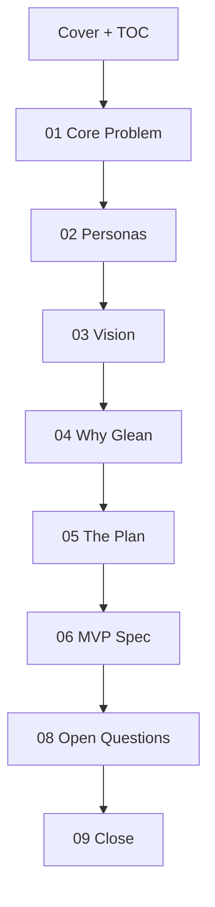

# Glean for Teachers — Interactive PRD Website

An interactive, scroll-based product narrative for a **Forward Deployed PM take-home**.
Built in **Next.js + React + Tailwind + Framer Motion** with rich section-level interactions.

- Live site: [https://gleanforteachers.vercel.app/](https://gleanforteachers.vercel.app/)
- Stack: Next.js 16, React 19, Tailwind, Framer Motion, Lucide

---

## What This Project Is

This site is a narrative PRD experience, not a static doc. It walks through:

1. The core problem in classrooms
2. Personas (teacher + student)
3. North-star product vision
4. Why Glean is defensible
5. MVP scope and phased plan
6. MVP technical spec and GTM details
7. Open questions and close

It is designed for fast scanning with progressive depth:
- top-level story for first-pass readers
- interactive detail layers for deeper review

---

## Visual Architecture



### Section rendering model

- `SectionDivider` (beige separator)
- `Slide` (full-screen content block)
- sticky header + dropdown navigation + scroll progress bar

---

## Tech Stack

- **Framework**: Next.js (App Router)
- **UI**: React + Tailwind CSS
- **Animation**: Framer Motion (`AnimatePresence`, entrance/transitions)
- **Icons**: Lucide React
- **Deployment**: Vercel

---

## Key File Map

- `components/prd-revamp-page.tsx`
  - Main page component
  - Section content, data arrays, and interaction state
- `public/videos/personas.mp4`
  - Center persona video asset
- `public/images/*.jpg`
  - Why Glean section imagery

---

## Local Development

### Prerequisites

- Node.js 18+
- npm

### Run

```bash
npm install
npm run dev
```

Open: `http://localhost:3000` (or next available port)

### Production build

```bash
npm run build
npm run start
```

---

## Interaction Design Notes

- **Sticky top nav** with section-aware active state
- **Progress bar** tied to scroll depth
- **Tabbed deep-dive spec** for architecture / GTM / metrics
- **Animated modal** for ecosystem-level impact
- **Interactive cards/tables** for skim-first comprehension

---

## Content/UX Principles Used

- Keep primary narrative linear
- Put detail behind interaction affordances
- Prioritize teacher-loop proof in MVP before student tooling
- Make strategic tradeoffs explicit (signal precision, privacy by design)

---

## Deployment

This project is Vercel-ready.

1. Connect GitHub repo in Vercel
2. Set branch to `main`
3. Deploy

Any push to `main` can auto-deploy.

---

## Customization Pointers

In `components/prd-revamp-page.tsx`, update:

- `sectionItems` for nav labels/order
- `mvpSteps` for plan walkthrough content
- `roadmapPhases` for phased rollout language
- `V0_PROTOTYPE_URL` for embedded prototype source
- `ecosystemNodes` for impact modal content

---

## License

Private interview/take-home project content.
